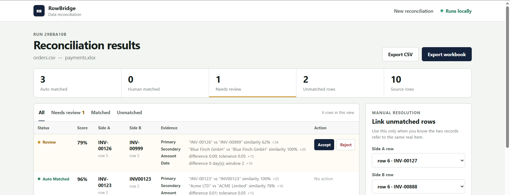
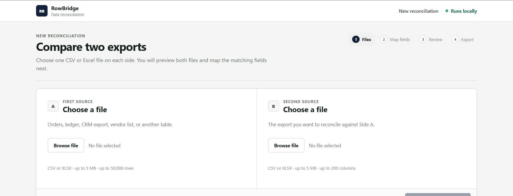
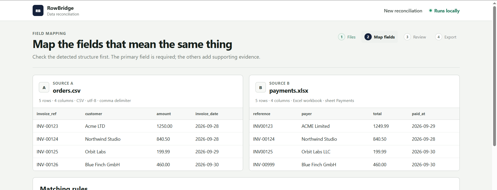

# RowBridge

[](https://github.com/SerDrozd/rowbridge/actions/workflows/ci.yml)

**Local-first reconciliation for CSV and Excel exports.**

RowBridge compares two tabular exports, proposes one-to-one matches, sends uncertain pairs to human review, and exports the current result with an audit trail. Source data stays on the machine running the app.



## Get started

Requirements: Python 3.12+ and [`uv`](https://docs.astral.sh/uv/).

```bash
git clone https://github.com/SerDrozd/rowbridge.git
cd rowbridge
uv sync --extra dev
uv run rowbridge
```

Open `http://127.0.0.1:8000`.

The included demo files can be reconciled with these mappings:

| Role | Side A | Side B |
| --- | --- | --- |
| File | `examples/orders.csv` | `examples/payments.xlsx` |
| Primary | `invoice_ref` | `reference` |
| Secondary text | `customer` | `payer` |
| Amount | `amount` | `total` |
| Date | `invoice_date` | `paid_at` |

Application state is stored in `.rowbridge/` by default. Set `ROWBRIDGE_DATA_DIR` to use another directory.

## Typical workflow

1. Load one CSV or XLSX export on each side.
2. Preview the files and map equivalent fields.
3. Review uncertain matches and accept, reject, or manually link rows.
4. Export the current reconciliation as CSV or XLSX.





## How matching works

A run always has a primary identity field. Secondary text, amount, and date fields are optional.

With all four signals enabled, the base weights are:

| Signal | Weight |
| --- | ---: |
| Primary identity | 55% |
| Secondary text | 20% |
| Amount | 15% |
| Date | 10% |

If optional fields are not mapped, their weights are removed and the remaining active weights are normalized.

Candidate generation checks normalized primary values first, then supporting blocks. Rows that still have no candidate can use a limited fuzzy fallback when the target side is small enough to scan.

Scored candidates are sorted by score, then by source row indexes. RowBridge walks that order and selects the first non-conflicting pairs. This is deterministic score-ordered selection, not an optimization for maximum total score.

A selected pair remains in review when its score is below the automatic-match threshold or when a close competing candidate exists for either source row.

More detail is in [`docs/MATCHING.md`](docs/MATCHING.md).

## Inputs and limits

CSV input supports comma, semicolon, tab, and pipe delimiters. Supported encodings are UTF-8 with or without BOM, UTF-16, and Windows-1252.

XLSX files are opened read-only. RowBridge uses the first worksheet that contains a non-empty header and at least one data row.

Each source file is limited to:

- 5 MB upload size;
- 50,000 data rows;
- 200 columns.

Duplicate headers, empty headers, malformed rows, oversized workbook archives, unsupported file types, and invalid amount/date mappings are rejected before a run is created.

## Review and audit trail

A review candidate can be accepted or rejected. Unmatched rows can also be linked manually.

Accepted pairs keep their algorithmic score and evidence. Rejected pairs return both rows to the unmatched pool. Manual links are stored as human decisions without inventing an algorithmic confidence score.

Review actions are appended to the run history with the affected rows, timestamp, previous state, resulting state, and a short explanation.

## Exports

CSV exports contain the current status, score, source row numbers, source payloads, and matching evidence.

XLSX exports contain:

- `Summary`;
- `Reconciliation`;
- `Unmatched A`;
- `Unmatched B`;
- `Review history`.

Values that begin with spreadsheet formula prefixes are escaped before export to reduce formula-injection risk.

## Local data and security

RowBridge binds to `127.0.0.1` by default and does not require an external matching API. Uploaded source files are used as local read-only inputs. Temporary staged copies are removed after successful run creation, and abandoned stages expire automatically.

The web layer applies trusted-host checks, restrictive response headers, `Cache-Control: no-store` for application pages, and browser Fetch Metadata checks for cross-site mutation requests.

RowBridge is a local single-user tool. Do not expose the development server directly to an untrusted network.

See [`SECURITY.md`](SECURITY.md) for the supported security model.

## Performance safeguards

Candidate counts are capped per source row, global fuzzy fallback is limited, and result pages are paginated. Large unmatched sets switch away from rendering thousands of select options.

The test suite includes a 2,000-row exact-match case that exercises candidate generation on a larger input. It is a regression case, not a benchmark.

## Development

```bash
uv sync --extra dev
uv run ruff check .
uv run mypy src tests
uv run pytest
uv build
```

CI runs on Windows and Ubuntu with Python 3.12 and 3.13.

The main implementation lives in `src/rowbridge/`:

```text
candidates.py      candidate generation
exports.py         CSV and XLSX exports
ingestion.py       parsing, detection, validation, staging
matching.py        scoring and score-ordered one-to-one selection
matching_utils.py  text, amount, and date normalization
service.py         reconciliation use case
storage.py         SQLite persistence and review mutations
web.py             FastAPI routes and local web protections
templates/         server-rendered UI
static/            local CSS and JavaScript
```

## Current limits

RowBridge supports one-to-one reconciliation only. It is not an accounting engine, automatic correction system, or probabilistic entity-resolution framework.

XLSX import selects one worksheet automatically and reads cached values. RowBridge does not execute spreadsheet formulas.

## More detail

- [`docs/MATCHING.md`](docs/MATCHING.md): candidate generation, scoring, and selection behavior
- [`docs/ARCHITECTURE.md`](docs/ARCHITECTURE.md): application boundaries and design choices
- [`SECURITY.md`](SECURITY.md): local security model and vulnerability reporting
- [`CONTRIBUTING.md`](CONTRIBUTING.md): development workflow

## License

MIT
